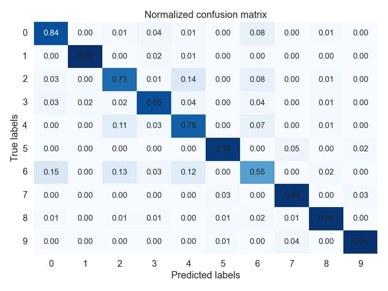
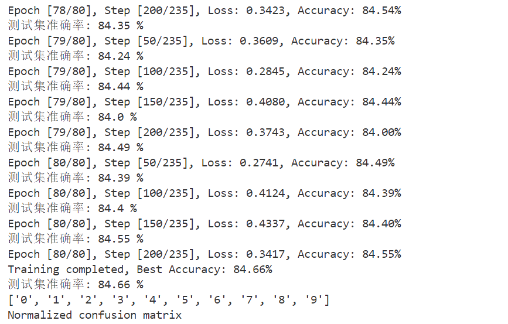

# 实验八 softmax回归
本次实验的主要任务是了解并掌握训练softmax回归做多类别分类的流程，学习两个机器学习库pytorch和torchvision的基本使用。

softmax回归是将回归应用到分类任务中的一种方法，线性回归模型适用于输出值为连续值的情况，在我们需要的输出为离散值的情况，我们不关心值具体是多少，只关心的是哪个的类别值更大，更有可能是哪一类的。对于softmax回归，根据数据有多少个特征，就能确定有多少个输入，而有多少个类别，模型也就能确定有多少个输出。本次实验将基于Fashion-MNIST数据集来实现softmax回归，并将最终结果以混淆矩阵的形式可视化。

## 实验环境
操作系统： Windows 11 Version 23H2 

Python 版本： Python 3.11.4 ('base':conda)

## 测试运行

### 使用的库

```python
import copy
import torch
import torch.nn as nn
import torch.optim as optim
import torch.utils.data as Data
import load_data as ld
import numpy as np
import matplotlib.pyplot as plt
import seaborn as sns
from sklearn.metrics import confusion_matrix
```

### 终端运行

在终端输入命令。
```shell
python softmax_regression.py
```

### 模型超参数
可以修改的一些模型超参数。
```python
# 超参数
learning_rate = 0.1  # 学习率
batch_size = 256      # mini-batch 大小
num_epochs = 80       # 迭代次数
num_workers = 0       # 多线程读取数据
```

## 实验结果

将实验的结果用混淆矩阵可视化，其中每一行代表了图像的真实标签，每一列代表了图像的预测标签，而混淆矩阵内的数字代表了对应真实结果和预测结果的概率，概率越高颜色越深，可以发现在对角线上的颜色最深，也就是说模型是比较有效的，大部分情况下可以分辨出图像的类别。



下面展示的是结果的正确率大小和训练时的损失值变化，正确率会在一定程度上变化基本稳定在84%~86%之间，损失值基本在0.25~0.30之间。



